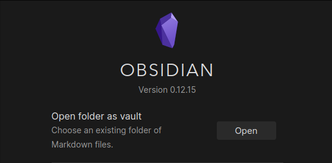

# Personal Knowledge Management
## _tools and techniques for learning in the 21st century_

---
## overview
This github repository contains a collection of [markdown](https://www.markdownguide.org/cheat-sheet/) files (noted by the `.md` file extension) which make up an _[Obsidian](https://obsidian.md/) Vault_. It is meant to serve as an introduction to the field of _Personal Knowledge Management (PKM)_ by providing tools, tips, and resources. Think of this as a launching point to delve deeper into related topics.

## what is Obsidian?
Obsidian is a note-taking application that allows you to create and edit markdown files in your local file system. What makes Obsidian stand out is its ability to easily create `[[links]]` between files and quickly navigate through notes.

This allows you to structure your notes as a _graph_ as opposed to a _hierarchical tree_, allowing us to build knowledge-bases that more closely resemble how we _actually think_ and that **increase in value** (rather than chaos and disorganization) as they grow.

Put another way, a graph-based note structure means we are much less likely to lose a note/file and are much more likely to **find exactly what we want, when we want it**.

_our default file systems force us to organize and structure our notes as **hierarchical trees**_

_Obsidian lets us link files to any other file, turning our notes into a **network**_

## setting this vault up in Obsidian
1. download [Obsidian](https://obsidian.md/)
2. download this repository (`Code -> Download ZIP`)
	- 
3. unzip the folder and open the root folder as a vault in Obsidian (folder name `PKM-guide-main`)
	- 

## dive deeper
I've written a number of articles about PKM and other related topics found in this vault. Here are two good starting points:
- [Getting Started with Personal Knowledge Management](https://wesleyfinck.medium.com/getting-started-with-personal-knowledge-management-45fe764a8e91)
- [Zettelkasten: networked note-taking for naturally networked thought](https://wesleyfinck.medium.com/zettelkasten-networked-note-taking-for-naturally-networked-thought-1712809a35a0)

I also made a short video overview of this vault, available here:
- [A Guide to Personal Knowledge Management]()